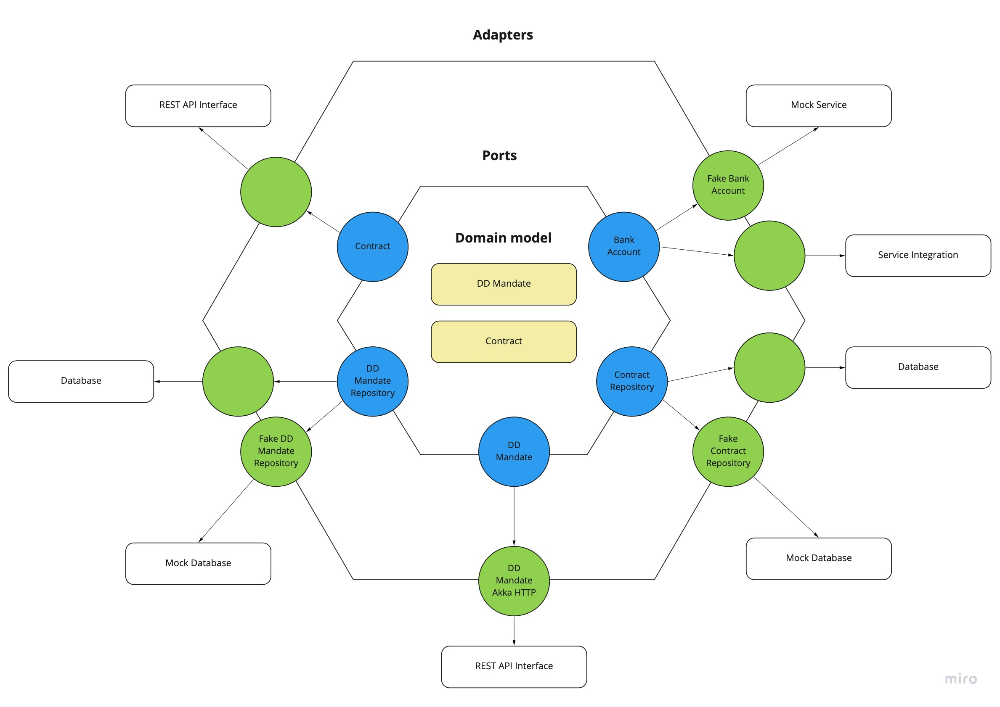
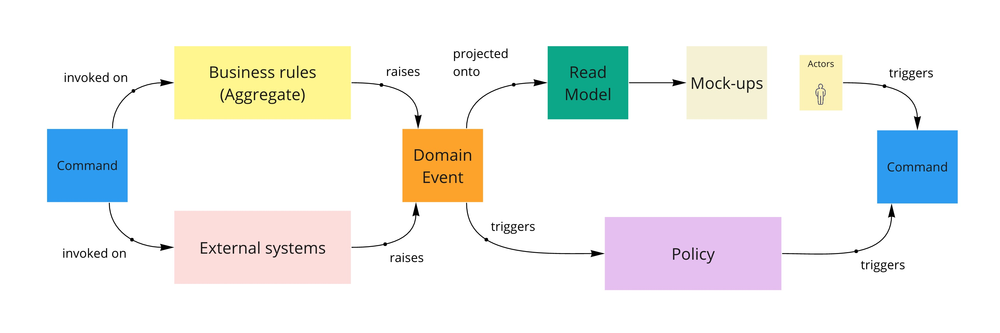
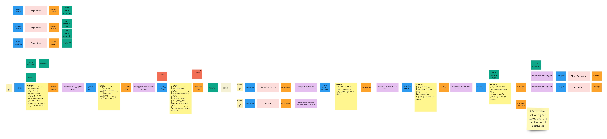
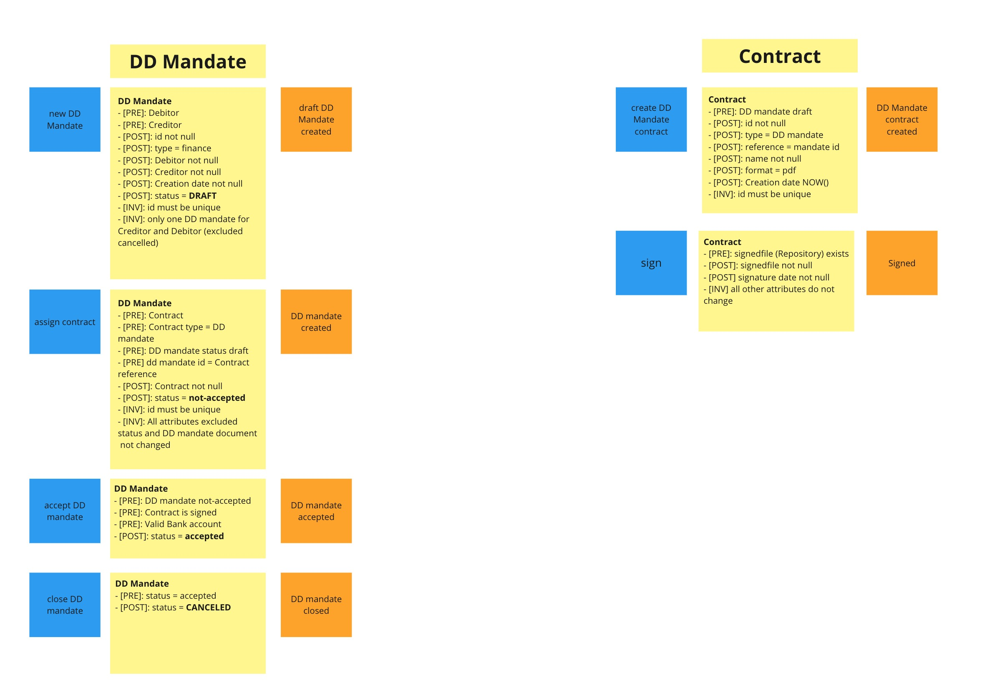
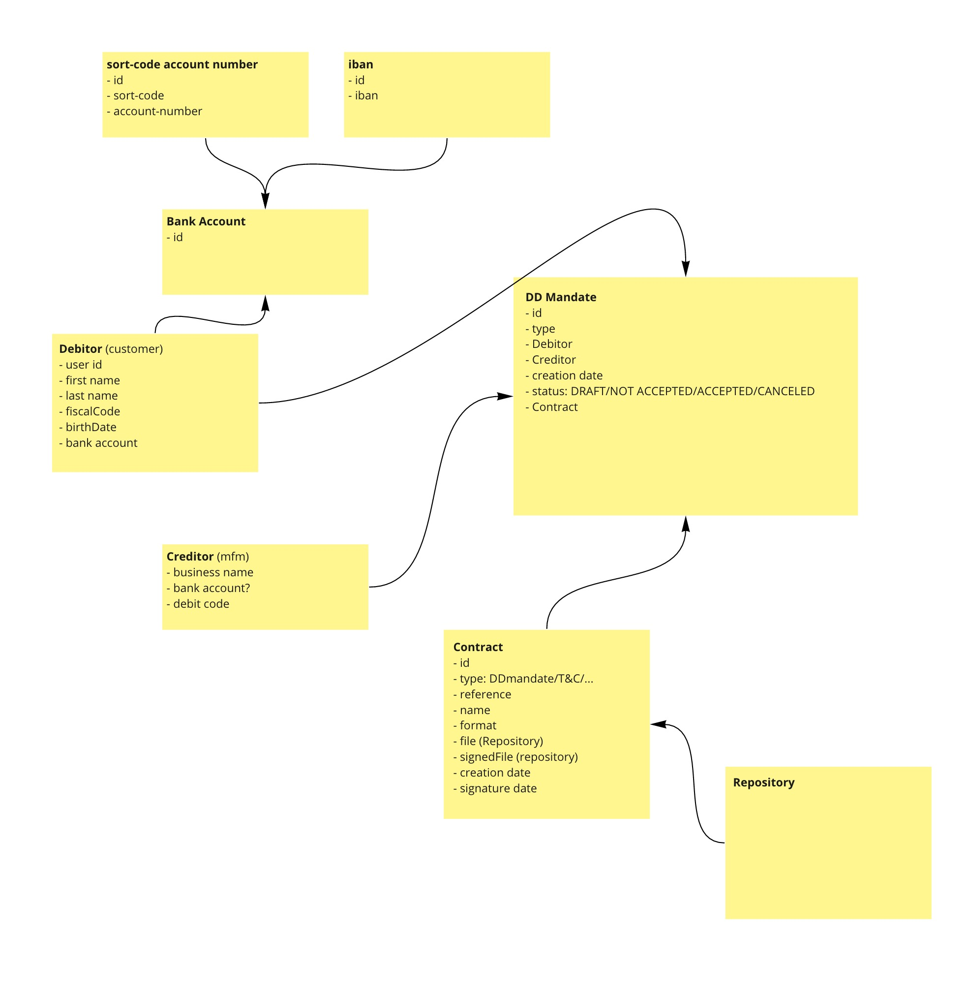

# POC DDD Direct Debit mandate

## Description

The scope of this POC is to implement a service based on:

 - [EventStorming](https://www.eventstorming.com/)  as software design tool
 - [Domain Driven Design](https://martinfowler.com/tags/domain%20driven%20design.html) as methodology to organise the domain model
 - [Hexagonal_architecture](https://en.wikipedia.org/wiki/Hexagonal_architecture_(software)) as architectural pattern to organise all the components of the services

The application will

to manage the subscription of a  Direct Debit mandate.

 using the [Domain Driven Design](https://martinfowler.com/tags/domain%20driven%20design.html)  approach and the [Hexagonal_architecture](https://en.wikipedia.org/wiki/Hexagonal_architecture_(software)).

The service lives in the Legel Context, so this service doesn't manage any payment logic but implement only the business rules needed to manage the mandate as agreement between the Debitor and the Debitor.

To design the service I used the [EventStorming](https://www.eventstorming.com/) methodology. The outcome of the ES design is visible [here](#event-storming-design).

The Context map below should helps to contestualise the project and the parts not touched.

Aggregates: 
- DD Mandate
- Contract

## Hexagonal architecture

## Event Storming Design

### Event Storming - Aggregate view

## Domain model

<!--stackedit_data:
eyJoaXN0b3J5IjpbMjU2ODMzOTU5LDE4MzgzNjQyNSw1MTg2MD
YxOTYsLTE0ODA3NjA1NTBdfQ==
-->