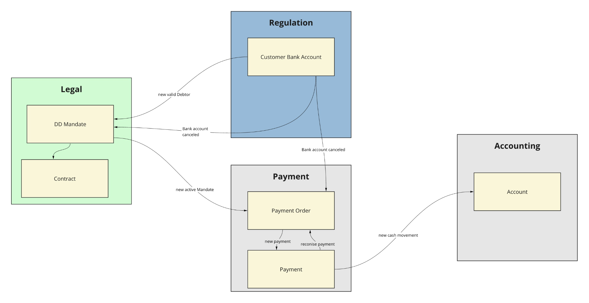
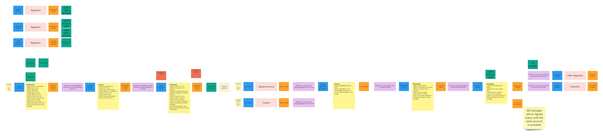
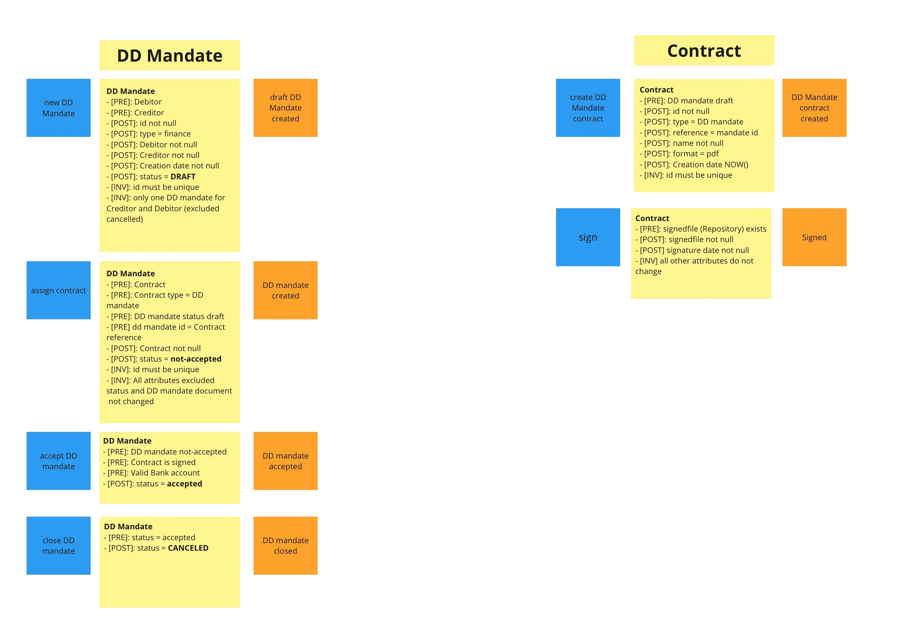
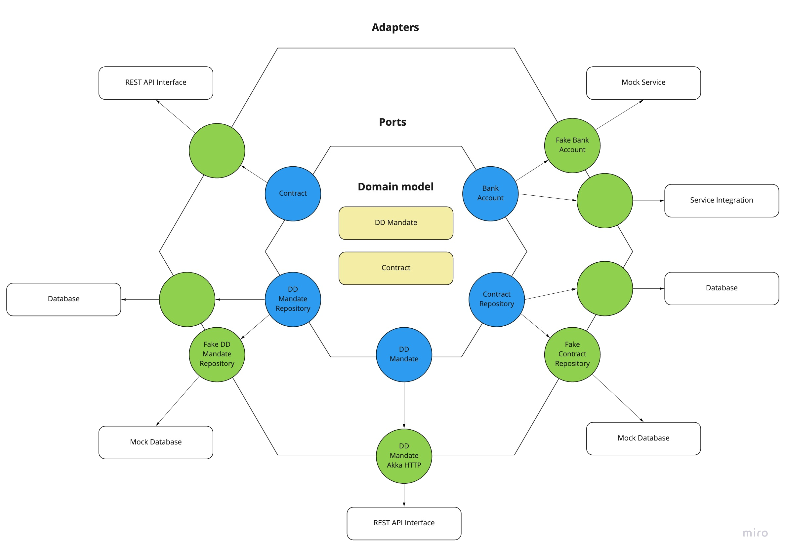
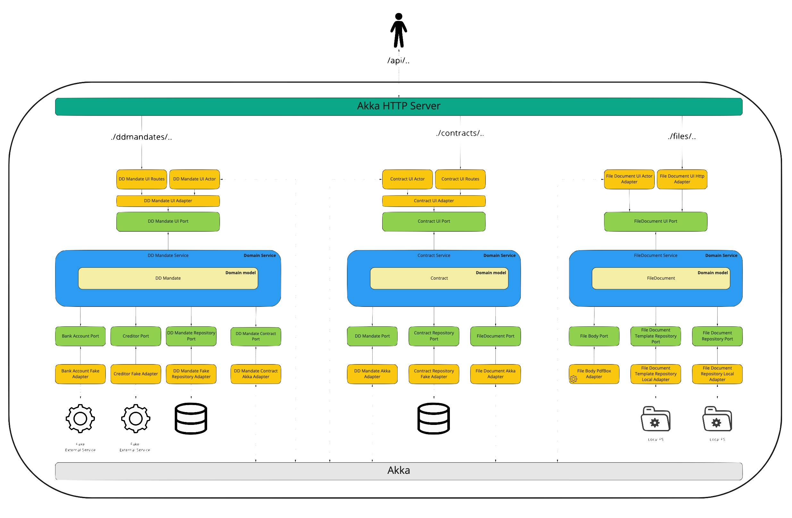

# POC DDD Direct Debit mandate

## Why this POC

The scope of this POC is to implement a service based on:

 - [EventStorming](https://www.eventstorming.com/)  to help me to discover the domain and then define the logic on the paper
 - [Domain Driven Design](https://martinfowler.com/tags/domain%20driven%20design.html) the approach that I want to follow to manage the business logic and its information 
 - [Hexagonal_architecture](https://en.wikipedia.org/wiki/Hexagonal_architecture_(software)) an architectural pattern to organise all the application components. This architecture put the Domain model in the centre of the application and, it works pretty well with a DDD approach.

The main goals that I want to achieve:

 1. Create an application well-organised with a package structure easier to navigate
 2. Maintain each aggregate completely independents from the others
 3. Be able to separate the aggregates managed in the same app in 2  or more app one for aggregate, for example with a minimal effort and touching only the most outer part.


## Step 1. Domain discovery  

The domain that I decided to analyse is the creation of a Direct Debit in the financial world.
Few thighs to know regarding the payments in the financial world:
1. SEPA and Bacs doesn't have any kind of protocol that evaluate if the customer is subscribing a DD Mandate using his banks or not... this check is in charge of the firm
2. An investment firm can accept investment only from the customer's bank accounts. It's not possible to accept money that comes from a parent's bank account or other.

The first step is to discover the domain, and the EventStorming - Big Picture is the perfect tool for this phase.
One of the possible outcomes of the Big Picture is the Context map. 
The context map is a map that explains which contexts are involved in your process, their responsibility and how they communicate.
###### Context map

To manage a DD Payment, there are at least 4 contexts involved:
### Legal Context
Here we have to manage all the rules (business logic) related to a DD mandate subscription like:
- Is the DD Mandate contract created correctly? Is it signed?
- Is the DD Mandate associated to a valid Debtor?
- Could be the DD Mandate accepted or cancelled?
- etc..
### Regulation Context
As we said previously, the financial regulator asks the firm to validate the bank account before accepting the money. They can't accept money that comes from bank accounts where the owner is not the customer.
This regulation rules generate consequences on the DD Mandate subscription process. The firm can accept DD Mandate with the debtor validated.
### Payment Context
The Payment context uses the DD mandate offered by the Legal context to understand if it's possible to accept the instruction received from the customer related a recurring payment of xx $$. 
Accepted the customer instruction (called Payment Order) then the context will generate the payment every time the instruction will ask to trigger a new payment.
All the business logic related to the payment order and payment will stay here.
### Accounting Context
Accounting is the last context that I found in this use case, and it manages the assets of the customers. Every time a payment comes to the firm and pass the payment context validation, then it will be allocated on the customer account.
It represents the assets of the customer in the financial firm.

We could have other contexts, for example, a CRM context to manage the communications to the customer or maybe fewer contexts. It depends on the situation. 

The initial problem is now split into 4 smaller problems linked.

In the next step, I took one of them, and I tried to design the aggregates included.

## Step 2. Software Design
I decided to focalise my attention on the legal context and its aggregates: **DDMandate** and **Contract**

Using the knowledge generated in the previous step, I started to design the process and the aggregates' interactions. The tool used id EventStorming - Design level.
The scope of this tool or framework is visualise all the commands and events that your aggregate has to manage and generate.
The outcome is the following board.  
###### EventStorming - Design level 


This schema is very useful to understand which command your aggregates need, which events and which information you need to retrieve outside your context.
On the aggregate level, I added the pre and post conditions necessary to be validated to consider the command executed correctly and the invariants.
These rules are very useful to test the domain model.
Validated the process and verified that it could work, the next step is to identify better our aggregates and highlight its command and events.
The result is the schema below, where I grouped all commands and events by aggregates.
###### EventStorming - Aggregates highlighted 



## Step 3. Implement the aggregates
The application is based on the hexagonal architecture, where the domain model is in the middle with the business logic, and the rest of the software components used to communicate externally are localised on the most external part of the architecture.
With this approach in the centre, you will have the business logic that should change not so often and all the critical business rules that guarantee the consistency of the aggregate.    
In the outer part, you have all the components that are more frequently updated and changed because you need to change your API interface or you need to change the database to persist your aggregates or because the third service that you use has changed its API.
###### Hexagonal architecture


This architecture introduced the concept of od Port. The Ports are interfaces that the service domain uses to communicate externally.
The great benefit of using the port is the decoupling between the domain model and the external world.
Each adapter will implement a port using the technology that you prefer/need without touch the core of your application. 
One of the most immediate benefits that you have with this approach is testing. It's very simple to create special mock adapters that you will use to test your core domain without involving the rest of the infrastructure.  

The schema below explains the current architecture.
###### architecture
 
In detail, I used:

- [Akka HTTP](https://doc.akka.io/docs/akka-http/current/index.html) to manage the REST API
- [Akka Actor](https://doc.akka.io/docs/akka/current/actors.html) to manage the communication between the 2 Aggregates inside the application
- Fake adapter to simulate external services like: 
   - Bank Account service
   - Creditor Service
   - both repositories are a list in memory right now
   - File service

The two aggregates haven't any shared class, only the identifier classes, and some Enum are shared in a dedicate package. Each aggregate has its classes. This segregation guarantees the possibility to move out an aggregate with a very minimal effort.   

The package structure used:
```
com.abaddon83                                                               
│
└───libs                                                                
│   └───{libName}                                                       
│   └───[..]                                
│
└───{contextName}                                                          
    └───shares                                                          
    │   └───"{entity}s"                                                 
    │   │      └───{Entity}Identity.scala                               
    │   │
    │   └───"{entity}s"
    │
    └───{aggregate}s                           
    │   └───adapters                        
    │   │   └───{entity}[scope]Adapter          
    │   │   │   └───{technology}               
    │   │   │   │           └───{Entity}[scope][technology]Adapter.scala                 
    │   │   │   └───[..]
    │   │   └───[..]
    │   │
    │   └───ports                           
    │   │   └───{Entity}[scope]Port.scala   
    │   │   └───[..]
    │   │
    │   └───domainModels                    
    │   │   └───{Entity}.scala              
    │   │   └───{entity}s                   
    │   │   │        └───{Entity}.scala     
    │   │   └───[..]                     
    │   │
    │   └───services                        
    │       └───{Aggregate}Service              
    │
    └───[..]

```
The *Scope* could assume this value:
- Repository: this port is a repository, used to store the entity/aggregate
- UI: this port is a controller  
- Nothing: generic scope, it's a generic port used to connect to something

