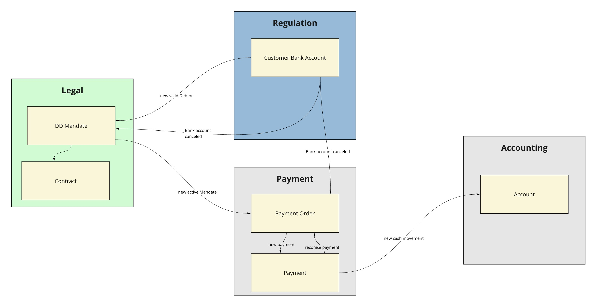

# POC DDD Direct Debit mandate
Status: WIP

## Description
the scope of this project is to implement a service to manage Direct Debit mandate using the [Domain Driven Design](https://martinfowler.com/tags/domain%20driven%20design.html)  approach and the [Hexagonal_architecture](https://en.wikipedia.org/wiki/Hexagonal_architecture_(software)).

The service lives in the Legel Context, so this service doesn't manage any payment logic but implement only the business rules needed to manage the mandate as agreement between the Debitor and the Debitor.

To design the service I used the [EventStorming](https://www.eventstorming.com/) methodology. The outcome of the ES design is visible [here]().

The Context map below should helps to contestualise the project and the parts not touched.

Aggregates: 
- DD Mandate
- Contract

## Event Storming Design

### Event Storming - Aggregate view

## Domain model

